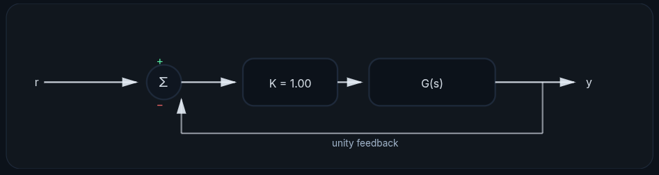

# JLocus – Interactive Control System Visualizer

JLocus is a lightweight, browser-based tool for visualizing and analyzing linear control systems.  
It is designed as an **educational tool** to help students and engineers build intuition about system dynamics, stability, and feedback.

The name **JLocus** comes from **JavaScript + Root Locus**, reflecting both the technology stack and the main control concept behind the tool.

## What JLocus Does

JLocus allows you to define a continuous-time transfer function:

G(s)

and automatically constructs the unity-feedback closed-loop system:

T(s) = K·G(s) / (1 + K·G(s))

From this closed-loop system, JLocus computes and visualizes:

- Step response of the closed-loop system T(s)
- Root locus based on the closed-loop characteristic equation
- Closed-loop pole locations for a given gain K
- Real-time interaction via a gain slider and numeric input

Everything runs directly in the browser using plain JavaScript.

## Block Diagram

The system analyzed by JLocus follows the classic unity-feedback structure:


The tool evaluates the full closed-loop transfer function, not just the open-loop plant.

## How It Works (Internals)

1. The user defines the numerator and denominator of G(s).
2. JLocus constructs the closed-loop transfer function T(s).
3. T(s) is converted to a state-space model using a standard controllable canonical form.
4. From this representation:
   - The step response is simulated in the time domain.
   - Closed-loop poles are computed as K varies.
5. All plots update instantly when K changes.

The numerical behavior is consistent with classical control theory references.

## Running JLocus Locally

### Option 1: Open Directly

1. Clone or download the repository.
2. Open `index.html` in a modern browser.

This works in most cases.

### Option 2: Local Web Server (Recommended)

Some browsers restrict local JavaScript module loading.  
Using a local server avoids these issues.

With Python:
```bash
python -m http.server 8000
```

Then open:
```
http://localhost:8000
```

With Node.js:
```bash
npx serve .
```

## Online Version (GitHub Pages)

JLocus is also available online via GitHub Pages:

https://moztoo.github.io/jlocus/

No installation required.

## Educational Focus

JLocus is intentionally designed as a **learning and teaching tool**, not as a replacement for professional control software.

The goals are:
- Build intuition about feedback and stability
- Visualize how poles move with gain K
- Connect equations with time-domain behavior
- Provide an accessible, zero-installation learning environment

## Planned Features

Future improvements may include:
- Frequency response plots (Bode and Nyquist)
- Ramp and impulse responses
- Discrete-time systems (z-domain)
- Non-unity feedback configurations
- Pole-zero editor with drag interaction
- Export of plots and data
- Preset textbook examples

## License

MIT License.

Use it for learning, teaching, experimenting, and extending.
